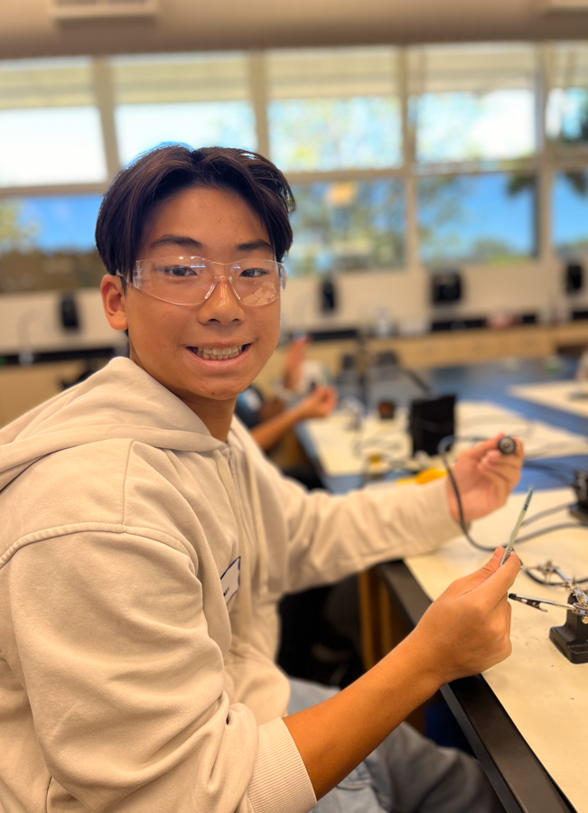
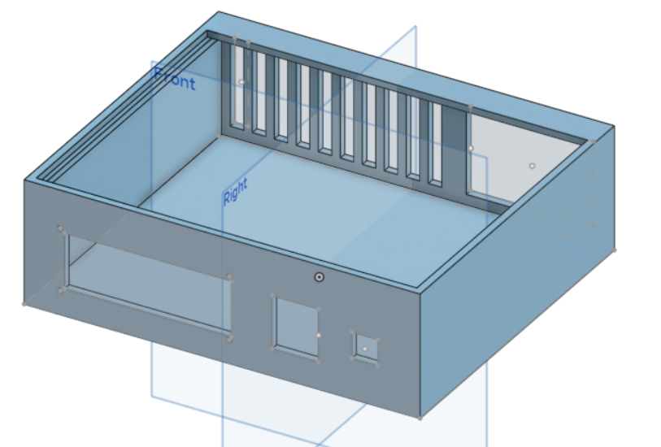
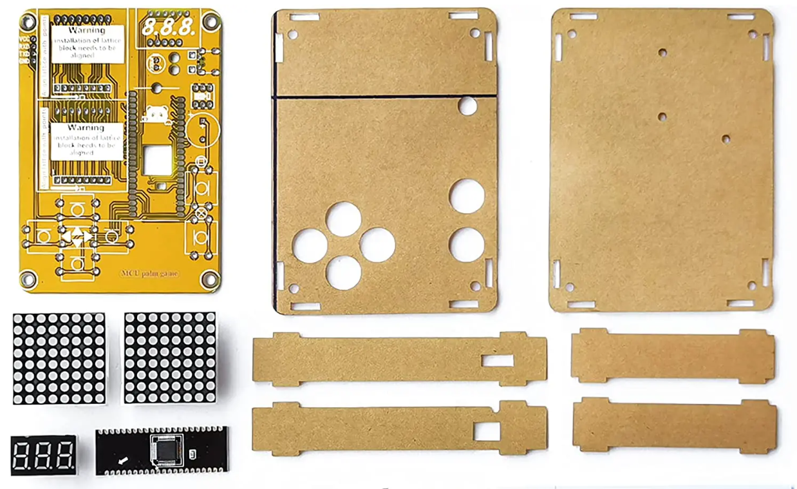

# Biometric Attendance System
The project is a biometric attendance system that allows the user to create personalized fingerprint IDs and also alerts the system when a registered fingerprint checks in. One of the biggest challenges for this project was the technical aspect of it since many of the components had different requirements for them to work properly. Some of my triumphs were not only connecting the hardware to the breadboard but also getting the code to work with the hardware. 
<!---You should comment out all portions of your portfolio that you have not completed yet, as well as any instructions:
```HTML -->
<!--- This is an HTML comment in Markdown -->
<!--- Anything between these symbols will not render on the published site -->
<!---```-->


| **Engineer** | **School** | **Area of Interest** | **Grade** |
|:--:|:--:|:--:|:--:|
| Nathan C | Archbishop Mitty High School | Biomedical Engineering | Incoming Junior

<!---**Replace the BlueStamp logo below with an image of yourself and your completed project. Follow the guide [here](https://tomcam.github.io/least-github-pages/adding-images-github-pages-site.html) if you need help.**-->



# Modifications 


<!---<iframe width="560" height="315" src="https://www.youtube.com/embed/55g2z3BQ6Bw?si=MaItMTyr6E6Ge4id" title="YouTube video player" frameborder="0" allow="accelerometer; autoplay; clipboard-write; encrypted-media; gyroscope; picture-in-picture; web-share" referrerpolicy="strict-origin-when-cross-origin" allowfullscreen></iframe>-->
<!---[](http://www.youtube.com/watch?v=55g2z3BQ6Bw)-->

For my modifications, I decided to transform my Biometric Attendance System into a Biometric Safe. I first sketched out a design for how I wanted to make a breadboard into an entire safe. I eventually decided that I needed a bottom base to hold all the electrical components and the real safe on the top; I came to this decision because I realized having all the electrical components in one box would ruin the point of the safe since there would be no space for the safe to hold anything if all the electrical components were in it. I used CAD to design a model for the bottom base and bought a wooden box for the top. My prototype of the bottom base included a hole for the LCD, fingerprint scanner, and two small buttons; there were also vents on the side for airflow and a hole in the back for the wire to connect to the Arduino. My prototype helped me discover my design mistakes and the well-made parts of my design. The wooden box fits very snugly into my first box meaning that the width of my box was almost perfect, however, other parts like the screw holes and buttonhole sizes were off meaning that I couldn't properly install my components. For my second prototype, I changed a couple of things such as adding ledges to hold the wooden box and re-adjusting the sizes of the boxes and LCD holes. The problem with my second prototype was that I had made the ledges too thin to hold the box, my solution for this was printing a thin plate to sit on those ledges so that it could hold up the box. My modifications for the wooden box were to add the fingerprint registering buttons within the box so that only the people with access to the safe could create new identities and a lock mechanism for the wooden box. I attached the buttons by soldering the buttons onto a board and then cutting a hole into the box and placing the board on top of the hole which allowed all the wires to connect down towards the breadboard and Arduino. My lock mechanism was a servo that didn't let the box be lifted due to a wooden piece that clashed with the servo piece every time it was locked.
  
# Final Milestone


<!---<iframe width="560" height="315" src="https://www.youtube.com/embed/55g2z3BQ6Bw?si=MaItMTyr6E6Ge4id" title="YouTube video player" frameborder="0" allow="accelerometer; autoplay; clipboard-write; encrypted-media; gyroscope; picture-in-picture; web-share" referrerpolicy="strict-origin-when-cross-origin" allowfullscreen></iframe>-->
[](http://www.youtube.com/watch?v=55g2z3BQ6Bw)


My project is the Biometric Attendance system. What I have accomplished since my second milestone is adding an LED and a buzzer to indicate when someone checks in with the system after registering their fingerprint. One of my biggest challenges with this milestone was the technical aspect of attaching the LED and buzzer. Since I had used up most of my digital pins, I initially placed the LED into pin 1 during my main code and my LED was constantly on, however when I ran a simple piece of code, the LED worked. I discovered that this issue was due to pin 1 being a pin that sends serial messages and since my main code included sending messages to the serial monitor, it constantly sent signals to the LED to be on which is why the simple code worked but not my main code. I solved this challenge by changing the LED pin to A1 so that it wouldn't constantly send signals to my LED. I also struggled with implementing the buzzer because I didn't route the power sources correctly so I wasn't sure if it made noise or not. I solved this problem by isolating the buzzer and running it with simple code first to make sure that it was connected properly. One of my biggest triumphs with this project was getting the LCD to light up since it was my first piece that I integrated into the breadboard and it was a big achievement for me to have something work. Some of the key topics I learned during this project were how the Arduino, breadboard, and other components work and learning the Arduino IDE and how to troubleshoot certain problems. I hope to learn in the future how to CAD and 3D models for my modifications because I plan to make a safe for my fingerprint scanner which uses a servo as a lock.


# Second Milestone
<!---<iframe width="560" height="315" src="https://www.youtube.com/embed/MZYSwUL4E3I?si=NHDFu7paFsT9TZGs" title="YouTube video player" frameborder="0" allow="accelerometer; autoplay; clipboard-write; encrypted-media; gyroscope; picture-in-picture; web-share" referrerpolicy="strict-origin-when-cross-origin" allowfullscreen></iframe>-->
[](http://www.youtube.com/watch?v=MZYSwUL4E3I)

My project is the Biometric Attendance system. What I have accomplished since my first milestone was adding the RTC module and the fingerprint scanner. They contribute to my final goals because the RTC also known as the Real Time Clock Module allows the system to know when the person registers their fingerprint and when they check back in. The fingerprint scanner is what captures the images of fingerprints and places them in the database which is important for the project. The most surprising part of this project so far has been the coding, attaching the components wasn't that complicated after understanding how a breadboard, Arduino, and jumper wires work. The coding, however, has been the most challenging part of this project because I'm new to the Arduino coding language, and debugging and syntax have been the most troublesome. However, I overcame this challenge through referencing other pieces of code and understanding what commands and functions do and I ultimately debugged and corrected my original code to reach my second milestone. What needs to be finished before the final milestone, is adding the buzzer and LED light to indicate certain actions so there are other alerts besides the text on the LCD. I also have small bugs in the project that need to be fixed up still before the third milestone. 

# First Milestone

<!---<iframe width="560" height="315" src="https://www.youtube.com/embed/omOlW2Dj-kw?si=UUPPxU9lnppjX9Y8" title="YouTube video player" frameborder="0" allow="accelerometer; autoplay; clipboard-write; encrypted-media; gyroscope; picture-in-picture; web-share" referrerpolicy="strict-origin-when-cross-origin" allowfullscreen></iframe>-->

[](http://www.youtube.com/watch?v=omOlW2Dj-kw)

The project that I chose was the Biometric Attendance System. The different components that I used for this project were the Arduino Uno, a breadboard, an LCD, jumper wires, buttons, resistors, a buzzer, and an LED. My milestone was to learn how the circuit works and how the Arduino connects to the breadboard. Since I wanted to first grasp the concept of the connections and make sure that all my parts worked, my milestone was to have the buttons display messages on my LCD screen. Through working on this milestone, I went through many challenges with the buttons and the LCD. The LCD was a challenge to connect because each part of the LCD had to go to a specific part or else the LCD would have energy past its threshold making it not work. Connecting the buttons was also a challenge because it needed to be connected to the 5V power source, the GRN source, and a pin on the Arduino, so making the four buttons fit compactly on the board was a challenge. Since I aimed to do everything at once with this milestone, I learned to isolate the problem to do things step by step and to make sure that all steps worked properly before moving on to the next one. My plan to complete this project is to continue that strategy that I learned and to take things step by step instead of plugging everything in at once and hoping that it works. For my next milestone, I'll focus first on the fingerprint scanner and getting that to take in data correctly.  


# Schematics 
This is a diagram of my actual project. It isn't 100% accurate because there are some items in Tinkercad that aren't proportional to the real version of the item and there are also components missing on Tinkercad such as the Fingerprint scanner and RTC module; other than that, the model should be accurate.


CAD model for modification of a base to hold all the electrical components 


# Code
This is the code for the Biometric Attendance System without Modifications 
<details>
<summary>Full Code Without Modifications</summary>

```c++
#include "Adafruit_Fingerprint.h" //fingerprint libary header file 
#include<EEPROM.h> // command for storing data 
#include<LiquidCrystal.h> //lcd header file 
LiquidCrystal lcd(8,9,10,11,12,13);
#include<SoftwareSerial.h>
SoftwareSerial fingerprint(2,3); // for communation between senor and arduino 

#include <Wire.h>
#include "RTClib.h" // libary file for RTC file 
RTC_DS3231 rtc; 

uint8_t id;
Adafruit_Fingerprint finger = Adafruit_Fingerprint(&fingerprint);


#define register_back 4
#define delete_ok 5
#define forward 6
#define reverse 7
#define indFinger 15
//#define match #
#define buzzer 16


#define records 10 // 10 f0r 10 users 
int user1,user2,user3,user4,user5,user6,user7,user8,user9,user10;
int getFingerprintIDez()
{
  uint8_t p = finger.getImage(); // Capture fingerprint image
  if (p != FINGERPRINT_OK)
    return -1; // Return -1 if getting image fails

  p = finger.image2Tz(1); // Convert image to template in slot 1
  if (p != FINGERPRINT_OK)
    return -1; // Return -1 if conversion fails

  p = finger.fingerFastSearch(); // Search for a match in templates
  if (p != FINGERPRINT_OK)
  {
    lcd.clear();
    lcd.print("Finger Not Found");
    lcd.setCursor(0, 1);
    lcd.print("Try Later");
    delay(2000);
    lcd.clear();
    return -1; // Return -1 if fingerprint not found
  }

  Serial.print("Found ID #");
  Serial.println(finger.fingerID); // Print found fingerprint ID
  return finger.fingerID; // Return the found fingerprint ID
}


uint8_t deleteFingerprint(uint8_t id)
{
    uint8_t p = -1;
    lcd.clear();
    lcd.print("Please wait");
    p = finger.deleteModel(id);
    if (p == FINGERPRINT_OK)
    {
        Serial.println("Deleted");
        lcd.clear();
        lcd.print("Finger Deleted");
        lcd.setCursor(0, 1);
        lcd.print("Successfully");
        delay(1000);
        lcd.clear();
    }
    else
    {
        Serial.print("Something Wrong");
        lcd.clear();
        lcd.print("Something Wrong");
        lcd.setCursor(0, 1);
        lcd.print("Try Again Later");
        delay(2000);
    }
    return p; // Ensure to return a value of type uint8_t
}

DateTime now;
void download(int eepIndex)
{
  if(EEPROM.read(eepIndex) != 0xff)
  {
    Serial.print("T->");
    if(EEPROM.read(eepIndex)<10)
    Serial.print('0');
    Serial.print(EEPROM.read(eepIndex++));
    Serial.print(':');
    if(EEPROM.read(eepIndex)<10)
    Serial.print('0');
    Serial.print(EEPROM.read(eepIndex++));
    Serial.print(':');
    if(EEPROM.read(eepIndex)<10)
    Serial.print('0');
    Serial.print(EEPROM.read(eepIndex++));
    Serial.print("D->");
    if(EEPROM.read(eepIndex)<10)
    Serial.print('0');
    Serial.print(EEPROM.read(eepIndex++));
    Serial.print('/');
    if(EEPROM.read(eepIndex)<10)
    Serial.print('0');
    Serial.print(EEPROM.read(eepIndex++));
    Serial.print('/');
    Serial.print(EEPROM.read(eepIndex++)<<8 | EEPROM.read(eepIndex++));
  }
  else
  {
    Serial.print("----------------");
  }
    Serial.print(" ");
}

void setup()
{
delay(1000);
lcd.begin(16,2);
Serial.begin(9600);
pinMode(register_back, INPUT);
pinMode(forward, INPUT);
pinMode(reverse, INPUT);
pinMode(delete_ok, INPUT);
//pinMode(match, INPUT)
pinMode(buzzer, OUTPUT);
pinMode(indFinger, OUTPUT);


if(digitalRead(register_back) == 0)
{
  digitalWrite(buzzer,HIGH);
  delay(500);
  digitalWrite(buzzer, LOW);
  lcd.clear();
  lcd.print("Please wait !");
  lcd.setCursor(0,1);
  lcd.print("Downloading Data");

  Serial.println("Please wait");
  Serial.println("Downloading Data...");
  Serial.println();

  Serial.print("S.No. ");
  for(int i=0;i<records;i++)
  {
    digitalWrite(buzzer, HIGH);
    delay(500);
    digitalWrite(buzzer, LOW);
    Serial.print("User ID");
    Serial.print(i+1);
    Serial.print("");
  }
  Serial.println();
  int eepIndex=0;
  for(int i=0;i<30;i++)
  {
    if(i+1<10)
      Serial.print('0');
      Serial.print(i+1);
      Serial.print("");
      eepIndex = (i*7);
      download(eepIndex);
      eepIndex=(i*7)+210;
      download(eepIndex);
      eepIndex=(i*7)+420;
      download(eepIndex);
      eepIndex=(i*7)+630;
      download(eepIndex);
      eepIndex=(i*7)+840;
      download(eepIndex);
      eepIndex=(i*7)+1050;
      download(eepIndex);
      eepIndex=(i*7)+1260;
      download(eepIndex);
      eepIndex=(i*7)+1470;
      download(eepIndex);
      eepIndex=(i*7)+1680;
      download(eepIndex);
      Serial.println();
   }
}
if(digitalRead(delete_ok) == 0)
{
  lcd.clear();
  lcd.print("Please Wait");
  lcd.setCursor(0,1);
  lcd.print("Resetting....");
  for(int i=1000;i<1005;i++)
  EEPROM.write(i,0);
  for(int i=0;i<841;i++)
  EEPROM.write(i, 0xff);
  lcd.clear();
  lcd.print("System Reset");
  delay(1000);
}
lcd.clear();
lcd.print("Fingerprint");
lcd.setCursor(0,1);
lcd.print("Attendance System");
delay(2000);
lcd.clear();
digitalWrite(buzzer, HIGH);
delay(500);
digitalWrite(buzzer, LOW);
for(int i=1000;i<1000+records;i++)
{
  if(EEPROM.read(i)== 0xff)
  EEPROM.write(i,0);
}
finger.begin(57600);
Serial.begin(9600);
lcd.clear();
lcd.print("Finding Module..");
lcd.setCursor(0,1);
delay(2000);
if (finger.verifyPassword())
{
  Serial.println("Found fingerprint sensor");
  lcd.clear();
  lcd.print("Module Found");
  delay(2000);
}
else
{
   Serial.println("Did not find fingerprint sensor :(");
  lcd.clear();
  lcd.print("Module Not Found");
  lcd.setCursor(0,1);
  lcd.print("Check connections");
  while(1);
}

if(! rtc.begin())
Serial.println("Couldn't find RTC");


if(rtc.lostPower())
{
  Serial.println("RTC is NOT running");
  rtc.adjust(DateTime(2024,14,6,8,42,0));
}
//rtc.adjust(DateTime(2024,14,6,9,25,40));
lcd.setCursor(0,0);
lcd.print("Press Match to");
lcd.setCursor(0,1);
lcd.print("Start System");
delay(3000);

user1= EEPROM.read(1000);
user2= EEPROM.read(1001);
user3= EEPROM.read(1002);
user4= EEPROM.read(1003);
user5= EEPROM.read(1004);
lcd.clear();
digitalWrite(indFinger, HIGH);

}
void loop ()
{
now = rtc.now();
lcd.setCursor(0, 0);
lcd.print("Time: ");

// Adjust hour for 12-hour format (AM/PM)
int hour = now.hour();
if (hour == 0) {
  hour = 12; // Midnight (00:xx) should display as 12:xx AM
} else if (hour > 12) {
  hour -= 12; // Convert 24-hour to 12-hour format for PM times
}

lcd.print(hour); // Display the adjusted hour
lcd.print(':');

if (now.minute() < 10) {
  lcd.print("0");
}
lcd.print(now.minute());
lcd.print(" ");

lcd.setCursor(0, 1);
lcd.print("Date: ");
lcd.print(now.day());
lcd.print('/');
lcd.print(now.month());
lcd.print('/');
lcd.print(now.year());
lcd.print(" ");

delay(500);

  int result=getFingerprintIDez();
  if(result>0)
  {
    digitalWrite(indFinger, LOW);
    digitalWrite(buzzer, HIGH);
    delay(100);
    digitalWrite(buzzer, LOW);
    lcd.clear();
    lcd.print("ID:");
    lcd.print(result);
    lcd.setCursor(0,1);
    lcd.print("Please Wait....");
    delay(1000);
    attendance(result);
    lcd.clear();
    lcd.print("Attendance");
    lcd.setCursor(0,1);
    lcd.print("Registered");
    delay(1000);
    digitalWrite(indFinger, HIGH);
    return;
  }
  checkKeys();
  delay(300);
}

void attendance (int id)
{
  int user=0, eepLoc=0;
  if(id==1)
  {
    eepLoc=0;
    user=user1++;
  }
  else if(id == 2)
  {
    eepLoc= 210;
    user=user2++;
  }
  else if (id == 3)
  {
    eepLoc=420;
    user=user3++;
  }
  else if (id == 4)
  {
    eepLoc=630;
    user=user4++;
  }
  else if (id == 5)
  {
    eepLoc=0;
    user=user5++;
  }
  else if (id == 6)
  {
    eepLoc = 840;
    user=user6++;
  }
  else if (id == 7)
  {
    eepLoc=1050;
    user=user7++;
  }
  else if (id == 8)
  {
    eepLoc=1260;
    user=user8++;
  }
  else if (id == 9)
  {
    eepLoc = 1470;
    user=user9++;
  }
  else if (id == 10)
  {
    eepLoc=1680;
    user=user10++;
  }
  else 
  return;

  int eepIndex=(user*7)+eepLoc;
  EEPROM.write(eepIndex++, now.hour());
  EEPROM.write(eepIndex++, now.minute());
  EEPROM.write(eepIndex++, now.second());
  EEPROM.write(eepIndex++, now.day());
  EEPROM.write(eepIndex++, now.month());
  EEPROM.write(eepIndex++, now.year()>>8);
  EEPROM.write(eepIndex++, now.year());

  EEPROM.write(1000,user1);
  EEPROM.write(1001,user2);
  EEPROM.write(1002,user3);
  EEPROM.write(1003,user4);
  //EEPROM.write(1004,user5);
}

void checkKeys()
{
  if(digitalRead(register_back) == 0)
  {
    lcd.clear();
    lcd.print("Please Wait");
    delay(1000);
    while(digitalRead(register_back) == 0);
    Enroll();
  }
  else if(digitalRead(delete_ok) == 0)
  {
    lcd.clear();
    lcd.print("Please Wait");
    delay(1000);
    delet();
  }
}

void Enroll()
{
  int count=1;
  lcd.clear();
  lcd.print("Enter Finger ID:");

  while(1)
  {
    lcd.setCursor(0,1);
    lcd.print(count);
    if(digitalRead(forward)==0)
    {
      count++;
      if(count>records)
      count=1;
      delay(500);
    } 
    else if (digitalRead(reverse) == 0)
    {
      count--;
      if(count<1)
      count=records;
      delay(500);
    }
    else if(digitalRead(delete_ok) == 0)
    {
      id=count;
      getFingerprintEnroll();
      for(int i=0;i<records;i++)
      {
        if(EEPROM.read(i) !=0xff)
        {
          EEPROM.write(i,id);
          break;
        }
      }
      return;
    }
    else if (digitalRead(register_back) == 0)
    {
      return;
    }
  }
}
void delet()
{
  int count=1;
  lcd.clear();
  lcd.print("Delete Finger ID");

  while(1)
  {
    lcd.setCursor(0,1);
    lcd.print(count);
    if(digitalRead(forward) == 0)
    {
      count++;
      if(count>records)
      count=1;
      delay(500);
    }
    else if(digitalRead(reverse) == 0)
    {
      count--;
      if(count<1)
      count=records;
      delay(500);
    }
    else if(digitalRead(delete_ok) == 0)
    {
      id=count;
      deleteFingerprint(id);
      for(int i=0;i<records;i++)
      {
        if(EEPROM.read(i)==id)
        {
          EEPROM.write(i, 0xff);
          break;
        }
      }
      return;
    }
    else if (digitalRead(register_back)==0)
    {
      return;
    }
}
}

uint8_t getFingerprintEnroll()
{
int p = -1;
lcd.clear();
lcd.print("finger ID");
lcd.print(id);
lcd.setCursor(0,1);
lcd.print("Place Finger");
delay(2000);
while(p != FINGERPRINT_OK)
{
  p = finger.getImage();
  switch (p)
  {
    case FINGERPRINT_OK:
    Serial.println("Image Taken");
    lcd.clear();
    lcd.print("Image taken");
    break;
    case FINGERPRINT_NOFINGER:
    Serial.println("No Finger");
    lcd.clear();
    lcd.print("No Finger Found");
    break;
    case FINGERPRINT_PACKETRECIEVEERR:
    Serial.println("Communation error");
    lcd.clear();
    lcd.print("Comm Error");
    break;
    case FINGERPRINT_IMAGEFAIL:
    Serial.println("Imaging error");
    lcd.clear();
    lcd.print("Imaging Error");
    break;
    default:
    Serial.println("Unknown error");
    lcd.clear();
    lcd.print("Unknown Error");
    break;
  }
}

p = finger.image2Tz(1);
switch(p){
  case FINGERPRINT_OK:
  Serial.println("Image converted");
  lcd.clear();
  lcd.print("Image converted");
  break;
  case FINGERPRINT_IMAGEMESS:
  Serial.println("Image too messy");
  lcd.clear();
  lcd.print("Image too messy");
  case FINGERPRINT_PACKETRECIEVEERR:
  Serial.println("Communication error");
  lcd.clear();
  lcd.print("Comm Error");
  return p;
  case FINGERPRINT_FEATUREFAIL:
  Serial.println("Could not find fingerprint features");
  lcd.clear();
  lcd.print("Feature Not Found ");
  return p;
  case FINGERPRINT_INVALIDIMAGE:
  Serial.println("Couldn not find fingerprint features");
  lcd.clear();
  lcd.print("Feature Not Found");
  return p;
  default:
  Serial.println("Unknown Error");
  lcd.clear();
  lcd.print("Unknown Error");
  return p;
} 

Serial.println("Remove finger");
lcd.clear();
lcd.print("Remove Finger");
delay(2000);
p=0;
while (p != FINGERPRINT_NOFINGER){
  p = finger.getImage();
}
Serial.print("ID"); Serial.println(id);
p = -1;
Serial.print("Place the same finger again");
lcd.clear();
lcd.print("Place Finger");
lcd.setCursor(0,1);
lcd.print("Again");
while (p != FINGERPRINT_OK){
  p = finger.getImage();
  switch(p) {
    case FINGERPRINT_OK:
    Serial.println("Image taken");
    break;
    case FINGERPRINT_NOFINGER:
    Serial.print(".");
    break;
    case FINGERPRINT_PACKETRECIEVEERR:
    Serial.println("Communication error");
    break;
    case FINGERPRINT_IMAGEFAIL:
    Serial.println("Imaging error");
    break;
    default:
    Serial.println("Unknown error");
    return;
  }
}

p = finger.image2Tz(2);
switch (p){
  case FINGERPRINT_OK:
  Serial.println("Image converted");
  break;
  case FINGERPRINT_IMAGEMESS:
  Serial.println("Image too messy");
  return p;
  case FINGERPRINT_PACKETRECIEVEERR:
  Serial.println("Communication error");
  return p;
  case FINGERPRINT_INVALIDIMAGE:
  Serial.println("Couldn't not find fingerprint features");
  return p;
  default:
  Serial.println("Unknown error");
  return p;
}

Serial.print("ID "); Serial.println(id);
p =finger.storeModel(id);
if(p == FINGERPRINT_OK){
  Serial.println("Stored!");
  lcd.clear();
  lcd.print("Finger Stored!");
  delay(2000);
  lcd.clear();
} else if (p == FINGERPRINT_PACKETRECIEVEERR){
  Serial.println("Communication error");
  return p;
} else if (p == FINGERPRINT_BADLOCATION){
  Serial.println("Could not store in that location");
  return p;
} else if (p == FINGERPRINT_FLASHERR){
  Serial.println("Error writing to flash");
  return p;
} else {
  Serial.println("Unknown error");
  return p;
}
}
```
</details>
<details>

<summary>Code for Main Functions without Modifications (Enroll, Delete, Attendance) </summary>

```c++
//Fingerprint Delete Function 
uint8_t deleteFingerprint(uint8_t id)
{
    uint8_t p = -1;
    lcd.clear();
    lcd.print("Please wait");
    p = finger.deleteModel(id);
    if (p == FINGERPRINT_OK)
    {
        Serial.println("Deleted");
        lcd.clear();
        lcd.print("Finger Deleted");
        lcd.setCursor(0, 1);
        lcd.print("Successfully");
        delay(1000);
        lcd.clear();
    }
    else
    {
        Serial.print("Something Wrong");
        lcd.clear();
        lcd.print("Something Wrong");
        lcd.setCursor(0, 1);
        lcd.print("Try Again Later");
        delay(2000);
    }
    return p; // Ensure to return a value of type uint8_t
}

//Fingerprint Enrollment Function
uint8_t getFingerprintEnroll()
{
int p = -1;
lcd.clear();
lcd.print("finger ID");
lcd.print(id);
lcd.setCursor(0,1);
lcd.print("Place Finger");
delay(2000);
while(p != FINGERPRINT_OK)
{
  p = finger.getImage();
  switch (p)
  {
    case FINGERPRINT_OK:
    Serial.println("Image Taken");
    lcd.clear();
    lcd.print("Image taken");
    break;
    case FINGERPRINT_NOFINGER:
    Serial.println("No Finger");
    lcd.clear();
    lcd.print("No Finger Found");
    break;
    case FINGERPRINT_PACKETRECIEVEERR:
    Serial.println("Communation error");
    lcd.clear();
    lcd.print("Comm Error");
    break;
    case FINGERPRINT_IMAGEFAIL:
    Serial.println("Imaging error");
    lcd.clear();
    lcd.print("Imaging Error");
    break;
    default:
    Serial.println("Unknown error");
    lcd.clear();
    lcd.print("Unknown Error");
    break;
  }
}

p = finger.image2Tz(1);
switch(p){
  case FINGERPRINT_OK:
  Serial.println("Image converted");
  lcd.clear();
  lcd.print("Image converted");
  break;
  case FINGERPRINT_IMAGEMESS:
  Serial.println("Image too messy");
  lcd.clear();
  lcd.print("Image too messy");
  case FINGERPRINT_PACKETRECIEVEERR:
  Serial.println("Communication error");
  lcd.clear();
  lcd.print("Comm Error");
  return p;
  case FINGERPRINT_FEATUREFAIL:
  Serial.println("Could not find fingerprint features");
  lcd.clear();
  lcd.print("Feature Not Found ");
  return p;
  case FINGERPRINT_INVALIDIMAGE:
  Serial.println("Couldn not find fingerprint features");
  lcd.clear();
  lcd.print("Feature Not Found");
  return p;
  default:
  Serial.println("Unknown Error");
  lcd.clear();
  lcd.print("Unknown Error");
  return p;
} 

Serial.println("Remove finger");
lcd.clear();
lcd.print("Remove Finger");
delay(2000);
p=0;
while (p != FINGERPRINT_NOFINGER){
  p = finger.getImage();
}
Serial.print("ID"); Serial.println(id);
p = -1;
Serial.print("Place the same finger again");
lcd.clear();
lcd.print("Place Finger");
lcd.setCursor(0,1);
lcd.print("Again");
while (p != FINGERPRINT_OK){
  p = finger.getImage();
  switch(p) {
    case FINGERPRINT_OK:
    Serial.println("Image taken");
    break;
    case FINGERPRINT_NOFINGER:
    Serial.print(".");
    break;
    case FINGERPRINT_PACKETRECIEVEERR:
    Serial.println("Communication error");
    break;
    case FINGERPRINT_IMAGEFAIL:
    Serial.println("Imaging error");
    break;
    default:
    Serial.println("Unknown error");
    return;
  }
}

p = finger.image2Tz(2);
switch (p){
  case FINGERPRINT_OK:
  Serial.println("Image converted");
  break;
  case FINGERPRINT_IMAGEMESS:
  Serial.println("Image too messy");
  return p;
  case FINGERPRINT_PACKETRECIEVEERR:
  Serial.println("Communication error");
  return p;
  case FINGERPRINT_INVALIDIMAGE:
  Serial.println("Couldn't not find fingerprint features");
  return p;
  default:
  Serial.println("Unknown error");
  return p;
}

Serial.print("ID "); Serial.println(id);
p =finger.storeModel(id);
if(p == FINGERPRINT_OK){
  Serial.println("Stored!");
  lcd.clear();
  lcd.print("Finger Stored!");
  delay(2000);
  lcd.clear();
} else if (p == FINGERPRINT_PACKETRECIEVEERR){
  Serial.println("Communication error");
  return p;
} else if (p == FINGERPRINT_BADLOCATION){
  Serial.println("Could not store in that location");
  return p;
} else if (p == FINGERPRINT_FLASHERR){
  Serial.println("Error writing to flash");
  return p;
} else {
  Serial.println("Unknown error");
  return p;
}
}

//Fingerprint Attendance Function
int getFingerprintIDez()
{
  uint8_t p = finger.getImage(); // Capture fingerprint image
  if (p != FINGERPRINT_OK)
    return -1; // Return -1 if getting image fails

  p = finger.image2Tz(1); // Convert image to template in slot 1
  if (p != FINGERPRINT_OK)
    return -1; // Return -1 if conversion fails

  p = finger.fingerFastSearch(); // Search for a match in templates
  if (p != FINGERPRINT_OK)
  {
    lcd.clear();
    lcd.print("Finger Not Found");
    lcd.setCursor(0, 1);
    lcd.print("Try Later");
    delay(2000);
    lcd.clear();
    return -1; // Return -1 if fingerprint not found
  }

  Serial.print("Found ID #");
  Serial.println(finger.fingerID); // Print found fingerprint ID
  return finger.fingerID; // Return the found fingerprint ID
}
```
</details>
<details>

<summary>Code for Menu Display (Enroll & Delete)</summary>

```c++
//Menu for Enrolling a Fingerprint 
void Enroll()
{
  int count=1;
  lcd.clear();
  lcd.print("Enter Finger ID:");

  while(1)
  {
    lcd.setCursor(0,1);
    lcd.print(count);
    if(digitalRead(forward)==0)
    {
      count++;
      if(count>records)
      count=1;
      delay(500);
    } 
    else if (digitalRead(reverse) == 0)
    {
      count--;
      if(count<1)
      count=records;
      delay(500);
    }
    else if(digitalRead(delete_ok) == 0)
    {
      id=count;
      getFingerprintEnroll();
      for(int i=0;i<records;i++)
      {
        if(EEPROM.read(i) !=0xff)
        {
          EEPROM.write(i,id);
          break;
        }
      }
      return;
    }
    else if (digitalRead(register_back) == 0)
    {
      return;
    }
  }
}

//Menu for Deleting a Fingerprint 
void delet()
{
  int count=1;
  lcd.clear();
  lcd.print("Delete Finger ID");

  while(1)
  {
    lcd.setCursor(0,1);
    lcd.print(count);
    if(digitalRead(forward) == 0)
    {
      count++;
      if(count>records)
      count=1;
      delay(500);
    }
    else if(digitalRead(reverse) == 0)
    {
      count--;
      if(count<1)
      count=records;
      delay(500);
    }
    else if(digitalRead(delete_ok) == 0)
    {
      id=count;
      deleteFingerprint(id);
      for(int i=0;i<records;i++)
      {
        if(EEPROM.read(i)==id)
        {
          EEPROM.write(i, 0xff);
          break;
        }
      }
      return;
    }
    else if (digitalRead(register_back)==0)
    {
      return;
    }
}
}
```
</details>

# Bill of Materials

| **Part** | **Note** | **Price** | **Link** |
|:--:|:--:|:--:|:--:|
| Arduino UNO| The Arduino is used for connecting everything of the circuit together, providing power ot the breadboard and other components, and responsible of taking inputs and sending outputs through its microcontroller | $27 | <a href="https://www.amazon.com/Arduino-A000066-ARDUINO-UNO-R3/dp/B008GRTSV6?crid=6LAEYX0GW2YS&keywords=arduino+uno&qid=1670424142&sprefix=arduino+uno,aps,93&sr=8-1-spons&psc=1&smid=AA57DDZKZUZDL&spLa=ZW5jcnlwdGVkUXVhbGlmaWVyPUExUEpBQjY0VFAwMEE5JmVuY3J5cHRlZElkPUEwMjQxNTk5MldZVExZVUVaV0dPMyZlbmNyeXB0ZWRBZElkPUEwOTQ2MzM3TldERlZJRlBETEtRJndpZGdldE5hbWU9c3BfYXRmJmFjdGlvbj1jbGlja1JlZGlyZWN0JmRvTm90TG9nQ2xpY2s9dHJ1ZQ%3D%3D&linkCode=sl1&tag=howtoelect0e4-20&linkId=82cb8c219f6c8dfd4617f7ef8a53aed1&language=en_US&ref_=as_li_ss_tl"> Link </a> |
| R307 Fingerprint Sensor | The Fingerprint Sensor is used for taking images and scanning fingerprints and sending them back to the microcontroller on the Arduino | $17 | <a href="https://www.amazon.com/Fingerprint-Optical-Control-Attendance-Recognition/dp/B07SFYDM4M?crid=3FOXY42SAF4FT&keywords=r307&qid=1670424291&sprefix=r307,aps,92&sr=8-2&linkCode=sl1&tag=howtoelect0e4-20&linkId=eec25467d9df21024ef7f178ebd9ae74&language=en_US&ref_=as_li_ss_tl/"> Link </a> |
| DS3231 RTC Module  | The RTC Module is used for allowing the Arduino to know the time in the real world| $12 | <a href="https://www.amazon.com/HiLetgo-AT24C32-Arduino-Without-Battery/dp/B00LX3V7F0?crid=1QQNBAPK3XO9G&keywords=ds3231&qid=1670424321&sprefix=ds3231,aps,89&sr=8-1-spons&psc=1&spLa=ZW5jcnlwdGVkUXVhbGlmaWVyPUEyNTRJRzNJUktYUVFPJmVuY3J5cHRlZElkPUEwNzQzNDg0M1BKSFZNRDRXNkEwNyZlbmNyeXB0ZWRBZElkPUEwMzA3MDIxMllBTTVSNE5LTUdNMiZ3aWRnZXROYW1lPXNwX2F0ZiZhY3Rpb249Y2xpY2tSZWRpcmVjdCZkb05vdExvZ0NsaWNrPXRydWU%3D&linkCode=sl1&tag=howtoelect0e4-20&linkId=22b7c43bba77801d4153e6844a8934b6&language=en_US&ref_=as_li_ss_tl"> Link </a> |
| 16 x 2 LCD Display| The LCD is used for displaying the outputs that the Arduino gives after the inputs are given | $10 | <a href="https://www.amazon.com/HiLetgo-Character-Backlight-MEGA2560-Raspberry/dp/B079M3GWFG?keywords=16x2+lcd+display&qid=1670424064&sprefix=16x2+lcd,aps,92&sr=8-2-spons&psc=1&spLa=ZW5jcnlwdGVkUXVhbGlmaWVyPUExQUlTNkQ3NkVRNVYwJmVuY3J5cHRlZElkPUEwNTQ4ODM2SlRETUJPQVJMT1NPJmVuY3J5cHRlZEFkSWQ9QTAyNzc2OTRTTUxYSldYN1BVQ0Umd2lkZ2V0TmFtZT1zcF9hdGYmYWN0aW9uPWNsaWNrUmVkaXJlY3QmZG9Ob3RMb2dDbGljaz10cnVl&linkCode=sl1&tag=howtoelect0e4-20&linkId=15600955d73d19e66549c66ead8ebf02&language=en_US&ref_=as_li_ss_tl"> Link </a> |
| Potentiometer | The Potentiometer is used for controlling the amount of current flowing on certain parts of the breadboard so nothing gains more voltage than it can maintain | $9 | <a href="https://www.amazon.com/HiLetgo-Single-Joint-Potentiometer-Variable-Resistors/dp/B00MCK7JMS?keywords=10k%2Bpotentiometer&qid=1670424029&sprefix=10k%2Bpo%2Caps%2C96&sr=8-2-spons&spLa=ZW5jcnlwdGVkUXVhbGlmaWVyPUEyN0VNVUFKUzExOUdTJmVuY3J5cHRlZElkPUEwNTIyMDc3MTZTNk4yQVNPNEs5SyZlbmNyeXB0ZWRBZElkPUEwOTc1NDM5MzU0WEVEMEw2REtWJndpZGdldE5hbWU9c3BfYXRmJmFjdGlvbj1jbGlja1JlZGlyZWN0JmRvTm90TG9nQ2xpY2s9dHJ1ZQ%3D%3D&linkCode=sl1&tag=howtoelect0e4-20&linkId=8c7a6d802a5d9d1f34e62928b7a14bcb&language=en_US&ref_=as_li_ss_tl&th=1"> Link </a> |
| Push Buttons | Push Buttons are used to send signals to the digital pins of the Arduino | $5 | <a href="https://www.amazon.com/Momentary-Terminal-Pushbutton-Breadboard-Electronic/dp/B09R3ZPWJ7?keywords=tact%2Bpush%2Bbutton%2Bswitch&qid=1670424237&sprefix=tact%2Bpush%2Caps%2C93&sr=8-1-spons&smid=A14FP9XIRL6C1F&spLa=ZW5jcnlwdGVkUXVhbGlmaWVyPUFHOUs1SzRQOVZXNE8mZW5jcnlwdGVkSWQ9QTA4ODQxMzYxSEM1R1QxRktaR1hIJmVuY3J5cHRlZEFkSWQ9QTAzMTY3MDYyWDVWQlFLWkFFWjJUJndpZGdldE5hbWU9c3BfYXRmJmFjdGlvbj1jbGlja1JlZGlyZWN0JmRvTm90TG9nQ2xpY2s9dHJ1ZQ%3D%3D&linkCode=sl1&tag=howtoelect0e4-20&linkId=eefa107ce5444ff1c6342bcd3ad98ceb&language=en_US&ref_=as_li_ss_tl&th=1"> Link </a> |
| Buzzer 5V | The Buzzer is used to display noise output from the Arduino| $7 | <a href="https://www.amazon.com/Cylewet-Electronic-Magnetic-Continuous-Arduino/dp/B01N7NHSY6?crid=2KBK9BMQSB1CQ&keywords=buzzer+5v&qid=1670424263&sprefix=buzzer+5v,aps,98&sr=8-3&linkCode=sl1&tag=howtoelect0e4-20&linkId=39b1a4d117b8de65c554f8251f10c87b&language=en_US&ref_=as_li_ss_tl"> Link </a> |
| LED 5mm Any Color | The LED is used to display light output from the Arduino| $5 | <a href="https://www.amazon.com/MCIGICM-Circuit-Assorted-Science-Experiment/dp/B07PG84V17?crid=17WKNNY2U01ZR&keywords=led%2B5mm&qid=1670423887&sprefix=led%2B5mm%2Caps%2C95&sr=8-3&linkCode=sl1&tag=howtoelect0e4-20&linkId=d8a62fcc652a3be76fe65e94258292b9&language=en_US&ref_=as_li_ss_tl&th=1"> Link </a> |
| Connecting Wires | The Connecting Wires are used to link everything from the breadboard to the Arduino pins and allows currents to flow through them and provide power | $7 | <a href="https://www.amazon.com/EDGELEC-Breadboard-Optional-Assorted-Multicolored/dp/B07GD2BWPY?crid=H7TZFJO1QGTK&keywords=jumper%2Bwires&qid=1670423829&sprefix=jumper%2Bwires%2Caps%2C96&sr=8-1-spons&spLa=ZW5jcnlwdGVkUXVhbGlmaWVyPUFKVFBCTEpDVEoxSEUmZW5jcnlwdGVkSWQ9QTA0NDg2ODAyN0RGWVlJU1VDREREJmVuY3J5cHRlZEFkSWQ9QTA5NDU0MzYxSkE3VExKQkZEQUxaJndpZGdldE5hbWU9c3BfYXRmJmFjdGlvbj1jbGlja1JlZGlyZWN0JmRvTm90TG9nQ2xpY2s9dHJ1ZQ%3D%3D&linkCode=sl1&tag=howtoelect0e4-20&linkId=fb9cb1bfdb1eac87858ef96885bb79f0&language=en_US&ref_=as_li_ss_tl&th=1"> Link </a> |
| Breadboard | The Breadboard is used to allow current to flow so that all the parts on the breadboard can be powered and work properly  | $8 | <a href="https://www.amazon.com/Breadboards-Solderless-Breadboard-Distribution-Connecting/dp/B07DL13RZH?crid=6T9E1ZJ0A1ZJ&keywords=breadboard&qid=1670423851&sprefix=breadboard,aps,109&sr=8-1-spons&psc=1&spLa=ZW5jcnlwdGVkUXVhbGlmaWVyPUEyMVFBN003NDcwMzhDJmVuY3J5cHRlZElkPUEwNjI2OTk4MjRPNVBNVE5TNEdNRiZlbmNyeXB0ZWRBZElkPUEwNzgyNTA2Mzk3RkFTTTg1Qk9INSZ3aWRnZXROYW1lPXNwX2F0ZiZhY3Rpb249Y2xpY2tSZWRpcmVjdCZkb05vdExvZ0NsaWNrPXRydWU%3D&linkCode=sl1&tag=howtoelect0e4-20&linkId=019fbb8879193ec4d27cdb1a71084734&language=en_US&ref_=as_li_ss_tl"> Link </a> |


# Important Resources 
- [Biometric Attendance System Guide](https://how2electronics.com/fingerprint-biometric-attendance-system-arduino/)
- [Fingerprint Scanner User Manual](https://www.openhacks.com/uploadsproductos/r307_fingerprint_module_user_manual.pdf)
- [Collapsable Section in Portfolio](https://docs.github.com/en/get-started/writing-on-github/working-with-advanced-formatting/organizing-information-with-collapsed-sections)
- [Servo Lock Inspiration](https://www.youtube.com/watch?v=SS0IJ4thUi4)
- [LCD Connection Guide](https://docs.arduino.cc/learn/electronics/lcd-displays/)
- [CAD Website](https://www.onshape.com/en/)
- [RTC User Manual](https://cdn-learn.adafruit.com/downloads/pdf/adafruit-ds3231-precision-rtc-breakout.pdf)
  
# Challenges with Modifications 
During my modification of transforming my Biometric Attendance System into a fingerprint safe, I ran into some issues. My first challenge was to make everything mobile, since the biometric attendance system had everything on the breadboard it was much easier to connect items like buttons and the LCD. In order to make the safe possible and have the LCD displayed, I needed to get it off the board yet still have it work. My solution was to connect male to female wires from the LCD to the pins that they needed to be connected to. The buttons however were a bigger challenge because I needed them to be stable so that they could be pressed while still be mobile. My solution to this was grabbing a solderable board and soldering the four buttons onto the board. This was a challenge because the joint I made was often too weak due to the very small amount of pins that was showing from the buttons. The weak joints caused the wire to constantly disconnect making it a challenge to solder them on strongly and properly. One of the biggest challenge in the modification and the entire project in total was when my fingerprint scanner was holding incorrect data and wrongly assigning IDs. The ways I attempted to solve this problem were through checking code, rewiring my entire board, constantly running new versions of codes, and connecting the fingerprint scanner to a new Arduino. I believe the cause of the problem is a shorted or broken fingerprint scanner and I have over 12 hours trying to troubleshoot this issue. The problem was successfully solved after integrating a new fingerprint scanner. This meant that the problem wasn't with the software but rather the hardware. 

# Starter Milestone 
<!---<iframe width="560" height="315" src="https://www.youtube.com/embed/OumJj49xcUI?si=kpIN3PI6h_-X1IId" title="YouTube video player" frameborder="0" allow="accelerometer; autoplay; clipboard-write; encrypted-media; gyroscope; picture-in-picture; web-share" referrerpolicy="strict-origin-when-cross-origin" allowfullscreen></iframe>-->

[](http://www.youtube.com/watch?v=OumJj49xcUI)

The starter project that I chose was the Retro Arcade. The different components that I used for this project included multiple buttons, buzzers and display screens that I had to solder onto the board. The chip and the board contained most of the code, so in order for the project to work, everything had to be solder and connected properly. On the technical aspect I learned how to solder and to fix my mistakes through  de-solder using the pump and wick. One of the challenges that I faced in this project was being very accurate and precise with soldering, the reason why is because soldering joints that aren't supposed to be together causes a short within the system and doesn't allow the project to work. Since the gaps between each joint was very small, it required precise soldering and fixing and cleaning up all the gaps was one of the biggest challenges for me. I look forward to improving my soldering in my future projects and to hopefully make less mistakes with it.

# Bill of Materials for Starter Project 

| **Part** | **Note** | **Price** | **Link** |
|:--:|:--:|:--:|:--:|
| Retro Arcade Solder Kit| A retro arcade kit that gives everything including code and a microcontroller and only requires proper soldering in order for the arcade to work | $19 | <a href="https://www.amazon.com/Classic-Electronic-Soldering-Tetris-Machine/dp/B07HB3HPPJ/ref=asc_df_B07HB3HPPJ/?tag=hyprod-20&linkCode=df0&hvadid=693127141877&hvpos=&hvnetw=g&hvrand=8842038919251504859&hvpone=&hvptwo=&hvqmt=&hvdev=c&hvdvcmdl=&hvlocint=&hvlocphy=9032183&hvtargid=pla-570319477420&mcid=1332a71f7f923b70acee31a99e30721a&gad_source=1&th=1"> Link </a> |
<!---To watch the BSE tutorial on how to create a portfolio, click here.-->

# Schematics for Starter Project 
This is all the parts given from the Retro Arcade Kit. Most of the arcade is controlled by the microcontroller on the yellow plate.



